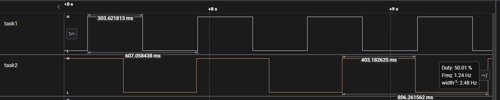
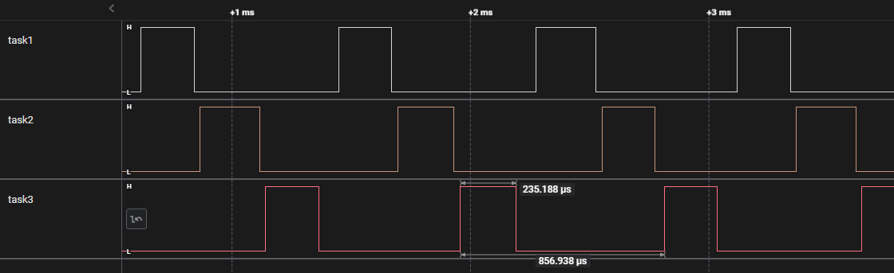

# AVRTOS - Enable concurrency on your AVR!

## What is an AVRTOS?

**AVRTOS** is a fun project undertaken during my free time, with the aim of
enabling concurrency on AVR boards. I haven't read any books about RTOSes or how
to create one. I just wanted to code a little. The primary goal was to keep it
simple and not resource-intensive. AVRTOS supports bare-C development, for
example, using Microchip Studio, as well as C++, for instance, with PlatformIO.
In its most basic version, it does not support the CMake build system.

One of the possibilities was to make the API similar to, for example, ZephyrRTOS
one. I didn't want to do that, even though it makes the code unportable to
non-AVR platforms. The main goal was the simplicity and the ability to
understand how the basic mechanisms of RTOSes work. AVRTOS has been documented
sufficiently that it can be understood and developed by Embedded Community.

AVRTOS has been tested using `toolchain-atmelavr v5.4.0` (C compiler) as well as
`toolchain-atmelavr v7.3.0` (C++ compiler). It does a few tricks using `inline
assembly` during scheduling processes. Currently, the only supported board is
the `ATmega328p`, but support for other boards can be easily added (see [Adding
custom AVR board](#adding-custom-avr-board)).

## Compiling

### Microchip Studio

To run and build a sample app using Microchip Studio, follow these steps:
* copy all files from the `src/` directory to your project directory
* add these files to your Microchip Studio project
* create main.(c|cpp) in your project
* compile the project
* use your own programmer to program the board or utilize the built-in app
  simulator

### PlatformIO

To run and build a sample app using PlatformIO, follow these steps:
* clone this repository to the <project_name>/lib directory
* PlatformIO will compile AVRTOS into a static library and link it into the
  executable file.

### Using CMake

At this time, the AVRTOS project does not support the CMake build system.
Creating a platform-independent CMake build system can be challenging, so this
task has been postponed. Only basic unit tests are supported.

## Adding custom AVR board

For now, only `ATmega328p` board is supported, which uses `TIMER0_COMPA_vect`
(scheduler), `TIMER2_COMPA_vect` (delays) and `USART_UDRE_vect` (logger)
interrupts.

To support another AVR board, add proper `avrtos_<board_name>.c` file to
`src/boards/` directory. The whole file should be guarded with `#if
defined(<board_name>)` directive (e.g. `#if defined(__AVR_ATmega328P__)` and
should implement functions declared in `src/boards/avrtos_board_impl.h` file.

This is not the most elegant possible solution as interrupt vectors could be
unified using defines, ~~BUT IT WORKS~~ but this can be improved in future
versions of AVRTOS.

## Examples

AVRTOS in its basic form supports: `concurrent scheduling, task-specific
arguments, non-blocking delays, task GPIO tracing, asynchronous UART logger and
mutexes`. Most of the features can be switched on/off using `avrtos_config.h`
file. For instance, if you wish to exclude the asynchronous logger from the
code, simply comment out the `#define AVRTOS_WITH_ASYNCHRONOUS_LOGGER` line.
This allows you to save valuable FLASH or RAM space.

Setting the `AVRTOS_CPU_CLOCK_FREQUENCY` value correctly in the
`avrtos_config.h` file is crucial to ensure accurate scheduling algorithms and
delays

### Concurrent scheduling example

```c
#include <avr/io.h>

#include "avrtos_init.h"

AVRTOS_TASK_DEFINE(task1);
AVRTOS_STACK_DEFINE(stack1, AVRTOS_MINIMAL_STACK_SIZE);

AVRTOS_TASK_DEFINE(task2);
AVRTOS_STACK_DEFINE(stack2, AVRTOS_MINIMAL_STACK_SIZE);

AVRTOS_TASK_DEFINE(task3);
AVRTOS_STACK_DEFINE(stack3, AVRTOS_MINIMAL_STACK_SIZE);

void thread1(void *_arg) {
    (void) _arg;
    while (1) {
        /* toggle pin 0 of PORTD */
        PORTD ^= (1 << 0);
        /* do stuff */
    }
    /* undefined behaviour - the code here should be unreachable */
}

void thread2(void *_arg) {
    (void) _arg;
    while (1) {
        /* toggle pin 1 of PORTD */
        PORTD ^= (1 << 1);
        /* do stuff */
    }
    /* undefined behaviour - the code here should be unreachable */
}

void thread3(void *_arg) {
    (void) _arg;
    while (1) {
        /* toggle pin 2 of PORTD */
        PORTD ^= (1 << 2);
        /* do stuff */
    }
    /* undefined behaviour - the code here should be unreachable */
}

int main(void) {
    (void) avrtos_task_create(&task1, thread1, stack1, sizeof(stack1), NULL);
    (void) avrtos_task_create(&task2, thread2, stack2, sizeof(stack2), NULL);
    (void) avrtos_task_create(&task3, thread3, stack3, sizeof(stack3), NULL);
    avrtos_scheduler_start();

    while (1) {
        /* code unreachable */
    }
}
```

### Task-specific arguments example

```c
#include <avr/io.h>

#include "avrtos_init.h"

AVRTOS_TASK_DEFINE(task1);
AVRTOS_STACK_DEFINE(stack1, AVRTOS_MINIMAL_STACK_SIZE);

AVRTOS_TASK_DEFINE(task2);
AVRTOS_STACK_DEFINE(stack2, AVRTOS_MINIMAL_STACK_SIZE);

typedef struct {
    uint64_t sleep_ms;
    uint8_t pin;
} example_args_t;

void thread(void *_arg) {
    volatile example_args_t *arg = (example_args_t *) _arg;
    while (1) {
        /* toggle pin defined in passed argument */
        PORTD ^= (1 << arg->pin);
    }
    /* undefined behaviour - the code here should be unreachable */
}

int main(void) {

    example_args_t arg1 = { .pin = 5 };
    example_args_t arg2 = { .pin = 6 };

    (void) avrtos_task_create(&task1, thread, stack1, sizeof(stack1), &arg1);
    (void) avrtos_task_create(&task2, thread, stack2, sizeof(stack2), &arg2);
    avrtos_scheduler_start();

    while (1) {
        /* code unreachable */
    }
}
```

### Non-blocking delays example

```c
#include <avr/io.h>

#include "avrtos_init.h"
#include "avrtos_delay.h"

AVRTOS_TASK_DEFINE(task1);
AVRTOS_STACK_DEFINE(stack1, AVRTOS_MINIMAL_STACK_SIZE);

AVRTOS_TASK_DEFINE(task2);
AVRTOS_STACK_DEFINE(stack2, AVRTOS_MINIMAL_STACK_SIZE);

typedef struct {
    uint64_t sleep_ms;
    uint8_t pin;
} example_args_t;

void thread(void *_arg) {
    volatile example_args_t *arg = (example_args_t *) _arg;
    while (1) {
        /* toggle pin defined in passed argument */
        PORTD ^= (1 << arg->pin);
        /* perform argument-specific non-blocking delay */
        avrtos_delay_ms(arg->sleep_ms);
    }
    /* undefined behaviour - the code here should be unreachable */
}

int main(void) {

    example_args_t arg1 = { .sleep_ms = 300, .pin = 5 };
    example_args_t arg2 = { .sleep_ms = 400, .pin = 6 };

    (void) avrtos_task_create(&task1, thread, stack1, sizeof(stack1), &arg1);
    (void) avrtos_task_create(&task2, thread, stack2, sizeof(stack2), &arg2);
    avrtos_scheduler_start();

    while (1) {
        /* code unreachable */
    }
}
```

Connecting logic analyzer to the defined pins, we get the following output:



### Task GPIO tracing example

```c
#include <avr/io.h>

#include "avrtos_init.h"
#include "avrtos_gpio_trace.h"

AVRTOS_TASK_DEFINE(task1);
AVRTOS_STACK_DEFINE(stack1, AVRTOS_MINIMAL_STACK_SIZE);
AVRTOS_GPIO_TRACE_DEFINE(trace1, D, 5);

AVRTOS_TASK_DEFINE(task2);
AVRTOS_STACK_DEFINE(stack2, AVRTOS_MINIMAL_STACK_SIZE);
AVRTOS_GPIO_TRACE_DEFINE(trace2, D, 6);

AVRTOS_TASK_DEFINE(task3);
AVRTOS_STACK_DEFINE(stack3, AVRTOS_MINIMAL_STACK_SIZE);
AVRTOS_GPIO_TRACE_DEFINE(trace3, D, 7);

// for Arduino UNO special macros can be used
// example: AVRTOS_GPIO_TRACE_DEFINE_ARDUINO_UNO(trace1, 13);
// example: AVRTOS_GPIO_TRACE_DEFINE_ARDUINO_UNO(trace1, A0);

void thread1(void *_arg) {
    (void) _arg;
    while (1) {
        /* toggle pin 0 of PORTD */
        PORTD ^= (1 << 0);
        /* do stuff */
    }
    /* undefined behaviour - the code here should be unreachable */
}

void thread2(void *_arg) {
    (void) _arg;
    while (1) {
        /* toggle pin 1 of PORTD */
        PORTD ^= (1 << 1);
        /* do stuff */
    }
    /* undefined behaviour - the code here should be unreachable */
}

void thread3(void *_arg) {
    (void) _arg;
    while (1) {
        /* toggle pin 2 of PORTD */
        PORTD ^= (1 << 2);
        /* do stuff */
    }
    /* undefined behaviour - the code here should be unreachable */
}

int main(void) {
    (void) avrtos_task_create(&task1, thread1, stack1, sizeof(stack1), NULL);
    (void) avrtos_task_create(&task2, thread2, stack2, sizeof(stack2), NULL);
    (void) avrtos_task_create(&task3, thread3, stack3, sizeof(stack3), NULL);

    avrtos_gpio_trace_install(&task1, &trace1);
    avrtos_gpio_trace_install(&task2, &trace2);
    avrtos_gpio_trace_install(&task3, &trace3);

    avrtos_scheduler_start();

    while (1) {
        /* code unreachable */
    }
}
```

Connecting logic analyzer to the defined pins, we get the following output:



### Asynchronous UART logger example

```c
#include <avr/io.h>

#include "avrtos_init.h"
#include "avrtos_delay.h"
#include "avrtos_logger.h"

AVRTOS_TASK_DEFINE(task1);
AVRTOS_STACK_DEFINE(stack1, AVRTOS_MINIMAL_STACK_SIZE);

AVRTOS_TASK_DEFINE(task2);
AVRTOS_STACK_DEFINE(stack2, AVRTOS_MINIMAL_STACK_SIZE);

typedef struct {
    uint64_t sleep_ms;
    uint8_t pin;
} example_args_t;

void thread(void *_arg) {
    volatile example_args_t *arg = (example_args_t *) _arg;
    while (1) {
        /* toggle pin defined in passed argument */
        PORTD ^= (1 << arg->pin);
        /* write UART message using interrupts */
        avrtos_log(test, INFO, "Toggled pin: %d, now delay: %lu ms", arg->pin, arg->sleep_ms);
        /* perform argument-specific non-blocking delay */
        avrtos_delay_ms(arg->sleep_ms);
    }
    /* undefined behaviour - the code here should be unreachable */
}

int main(void) {
    example_args_t arg1 = {.sleep_ms = 300, .pin = 5};
    example_args_t arg2 = {.sleep_ms = 400, .pin = 6};

    (void) avrtos_task_create(&task1, thread, stack1, sizeof(stack1), &arg1);
    (void) avrtos_task_create(&task2, thread, stack2, sizeof(stack2), &arg2);

    avrtos_scheduler_start();

    while (1) {
        /* code unreachable */
    }
}
```

Connecting UART pins to e.g. UART-to-USB converter, we get the following output:

```
INFO [test] Toggled pin: 6, now delay: 400 ms
INFO [test] Toggled pin: 5, now delay: 300 ms
INFO [test] Toggled pin: 5, now delay: 300 ms
INFO [test] Toggled pin: 6, now delay: 400 ms
INFO [test] Toggled pin: 5, now delay: 300 ms
INFO [test] Toggled pin: 6, now delay: 400 ms
INFO [test] Toggled pin: 5, now delay: 300 ms
INFO [test] Toggled pin: 6, now delay: 400 ms
INFO [test] Toggled pin: 5, now delay: 300 ms
INFO [test] Toggled pin: 5, now delay: 300 ms
...
```

### Mutexes example

```c
#include <avr/io.h>

#include "avrtos_init.h"
#include "avrtos_mutex.h"

AVRTOS_TASK_DEFINE(task1);
AVRTOS_STACK_DEFINE(stack1, AVRTOS_MINIMAL_STACK_SIZE);

AVRTOS_TASK_DEFINE(task2);
AVRTOS_STACK_DEFINE(stack2, AVRTOS_MINIMAL_STACK_SIZE);

AVRTOS_MUTEX_DEFINE(example_mutex);

int some_counter = 0;

void critical_section(void) {
    avrtos_mutex_lock(&example_mutex);
    some_counter++;
    avrtos_mutex_unlock(&example_mutex);
}

void thread1(void *_arg) {
    (void) _arg;
    while (1) {
        /* do stuff */
        // ...
        critical_section();
    }
    /* undefined behaviour - the code here should be unreachable */
}

void thread2(void *_arg) {
    (void) _arg;
    while (1) {
        /* do stuff */
        // ...
        critical_section();
    }
    /* undefined behaviour - the code here should be unreachable */
}

int main(void) {
    (void) avrtos_task_create(&task1, thread1, stack1, sizeof(stack1), NULL);
    (void) avrtos_task_create(&task2, thread2, stack2, sizeof(stack2), NULL);
    avrtos_scheduler_start();

    while (1) {
        /* code unreachable */
    }
}
```
